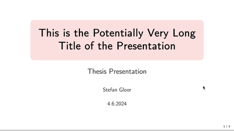

# Javascript Presentation Demo
Demo project using reveal.js and p5.js.

## Dependencies
Install latest `p5.min.js` from [Github](https://github.com/processing/p5.js/releases)
and place in root directory.

## Run
Start a webserver in the root directory, e.g.,
~~~
python -m http.server -b 127.0.0.1
~~~
and visit the site in your browser.
